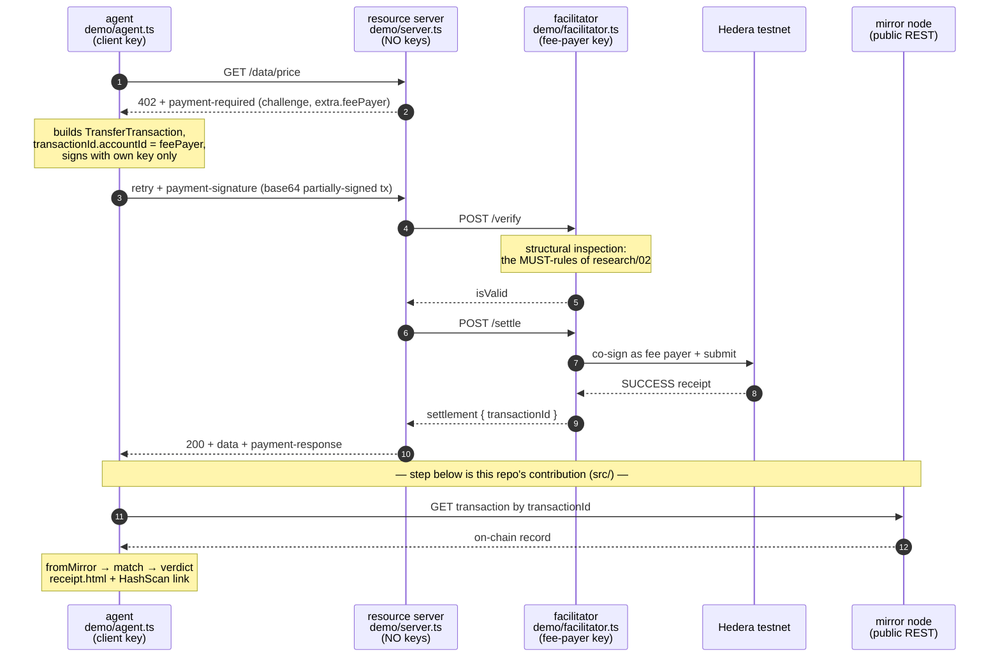
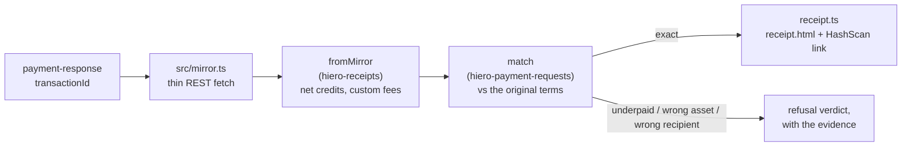

# Architecture

What runs where, who trusts whom, and why each line is drawn where it is.
The evidence behind every decision lives in [research/](research/).

## The system



Everything down to the `200` is the standard x402 flow, implemented by the
**official `@x402/*` packages** — we write wiring, not plumbing
([research/02](research/02-hedera-mapping.md)). The tail is this repo's
contribution: nothing downstream of the facilitator's word — the agent checks
the chain itself.

### The independent check, as a pipeline



The `match` rule is the same one hiero-checkout's merchant and payer already
share — three parties now agree on what "paid" means, none by trusting
another's word.

## Trust model

| Party           | Holds                  | Trusts                                                                                       | Verified by                                                       |
| --------------- | ---------------------- | -------------------------------------------------------------------------------------------- | ----------------------------------------------------------------- |
| Agent (client)  | its own key (`.env`)   | nothing after ⑦ — it checks the mirror itself                                                | —                                                                 |
| Resource server | **no keys**            | the facilitator's verify/settle answers                                                      | agent's step ⑦ catches a lying/failing facilitator after the fact |
| Facilitator     | fee-payer key (`.env`) | the transaction bytes it inspects (MUST-rules, [research/02](research/02-hedera-mapping.md)) | pre-submit structural inspection + preflight                      |
| Mirror node     | public data            | —                                                                                            | it _is_ the chain's record; anyone can re-query it                |

Two independent verifications, on purpose: the facilitator verifies
**before** submitting (structural inspection of the signed bytes); the agent
verifies **after** settlement (on-chain outcome vs original terms, same
`match` rule merchant and payer share in hiero-checkout). Different failure
modes, different checkers.

## Repo layout and responsibilities

```
src/                      the reusable library — no keys, no env, no I/O side effects
  requirements.ts         PaymentRequest ⇄ x402 PaymentRequirements (pure mapping;
                          both sides already share CAIP network ids + atomic string amounts)
  verify.ts               settlement → mirror lookup → fromMirror → match → verdict
                          (fetch injected/thin, so tests run on canned fixtures)
  stream.ts               the same verdict from a cryptographically PROVEN block
                          (verifySettlementFromBlock — proof checked first, fail-closed;
                          true transaction-id correlation via streams-node ≥ 0.2.0)
  receipt.ts              settlement + verdict → hiero-receipts HTML artifact
  mirror.ts               thin typed fetch for the 2–3 REST endpoints needed
                          (checkout's pattern; deliberately not enterprise-mirror —
                          research/04)
  config.ts               the testnet gate: refuses hedera:mainnet in code
  index.ts                barrel

demo/                     the bounty demo — consumes src/ like any user would
  facilitator.ts          official engine + fee-payer key; aliasPolicy: "reject"
  server.ts               Hono app, priced routes (HBAR, tinybars) + checkout links
  agent.ts                pays via delegated signing, then verifies against the
                          mirror and writes receipt.html
  provenance.ts           the trust ladder's top rung on committed proven blocks
  fixtures/               real preview-network blocks (genesis + block 467)

research/                 the evidence; this file the map
```

The line between `src/` and `demo/` is the publish line: `src/` could become
`@hiero-hackers/hiero-x402` later without touching the demo (out of scope for
the bounty).

## Decisions, with reasons

- **Build on `@x402/*` 2.19.0, don't reimplement** — Hedera is an officially
  specified scheme with the judges' own template; a re-port is a worse copy.
  Pin exact versions; install `@x402/paywall` explicitly (peer dep of
  `@x402/hono` at 2.19.0 — npm skips peers silently).
- **Self-hosted facilitator in the demo** — a live demo must not depend on a
  third party's uptime. blocky402 (verified alive, fee payer 0.0.7162784)
  stays as documented fallback only.
- **HBAR (`"0.0.0"`, tinybars)** — faucet-fundable, no token association, the
  path both reference implementations demonstrate.
- **v2 wire, tolerant inbound** — emit `payment-signature` /
  `payment-response`; accept legacy `X-PAYMENT` inbound like the scaffold does.
- **Thin mirror fetch over enterprise-mirror** — three endpoints don't
  justify a client dependency; revisit if verify grows real polling/backoff
  ([research/04](research/04-complementary-libraries.md)).
- **Keys only in `demo/facilitator.ts` and `demo/agent.ts`**, two separate
  faucet accounts, `.env` only. `src/` is key-free by construction, which is
  what makes it publishable later.
- **Everything testable offline** — vector-backed bridge round-trips,
  fixture-driven verdicts, MUST-rules as a table-driven suite. The only
  networked run is the demo itself (`npm run e2e`, not in CI).

- **The trust ladder is explicit** — facilitator's word → public mirror
  (`verify.ts`, the e2e) → block-stream proof (`stream.ts`, fixtures until
  HIP-1056 reaches testnet). Same verdict assembly at every rung; receipts
  state their provenance honestly (`unverified` vs `verified`).

## Growth seams (named now, built never — until asked)

HTS-token routes fall out of the official scheme; a browser payer is
hiero-checkout's existing WalletConnect signer; multi-agent correlation is
payment-requests' `byUniqueAmount`; merchant notifications are the
hiero-notifications `fulfils` adapter; discovery/MCP/A2A are spec'd upstream.
Each is a seam in `src/`'s interfaces, not a TODO in its code.
