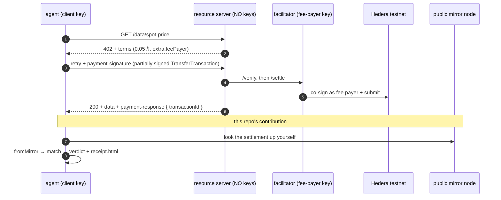
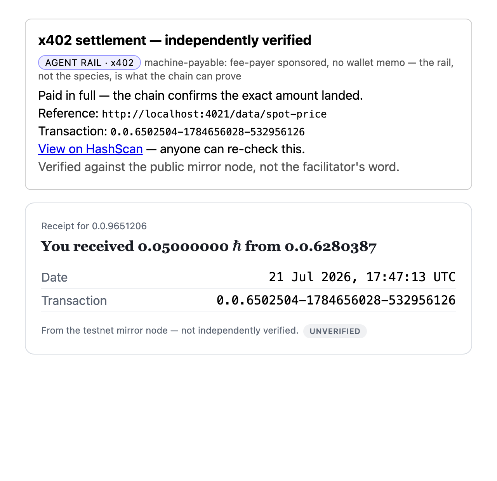
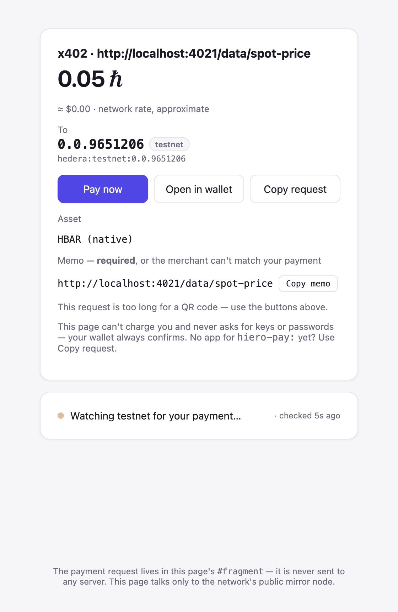
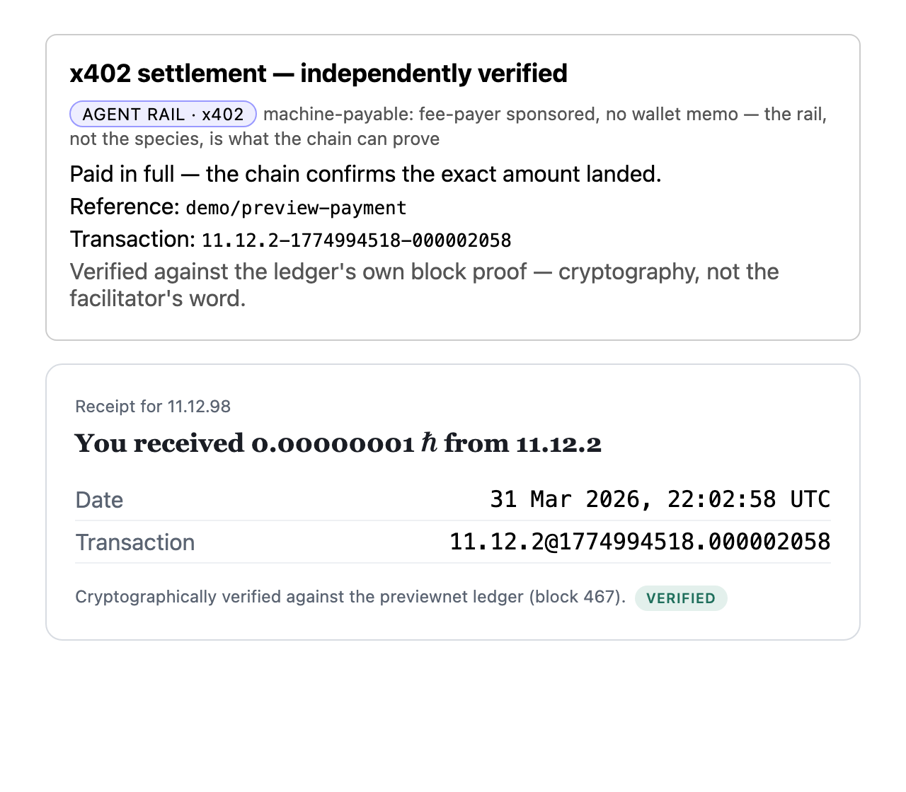

# hiero-x402

[](https://github.com/hiero-hackers/hiero-x402/actions/workflows/ci.yml)
[](https://github.com/hiero-hackers/hiero-x402/actions/workflows/codeql.yml)
[](LICENSE)
[](package.json)
[](https://scorecard.dev/viewer/?uri=github.com/hiero-hackers/hiero-x402)

**x402 on Hiero with verifiable settlement and receipts.** The official
`@x402/*` packages move the money; this repo proves it moved — an
independent, facilitator-free settlement check and a receipt artifact for
every payment an agent makes. Prototype, **testnet only** (enforced in code).

Every x402 flow ends with a `SettleResponse`: a claim, made by the party that
moved the money, that the money moved. Every reference implementation stops
there. Here, the agent — spending with no human in the loop — walks the
remaining distance itself: it looks the settlement up on the network's public
mirror node, normalizes what actually landed, judges it against the original
terms, and writes itself a receipt with the HashScan proof link.



## Run it

Two funded **ECDSA testnet** accounts ([faucet](https://portal.hedera.com/faucet)):
one for the facilitator (sponsors network fees), one for the agent (pays).
The resource server holds no keys at all.

```sh
npm install            # @hiero-hackers packages come from GitHub Packages —
                       # you need the usual read:packages token in ~/.npmrc
cp .env.example .env   # fill in the two accounts
npm run demo           # both rails, in order: facilitator (:4020) then
                       # server (:4021) — hub at http://localhost:4021/ui
npm run e2e            # the agent: 402 → sign → 200 → VERIFY → receipt.html
```

(The rails stay separate processes — the facilitator holds the fee-payer
key, the server holds none, the agent holds its own — `npm run demo` just
boots the first two in one terminal. `npm run facilitator` and
`npm run server` still exist for running them apart.)

The agent narrates each protocol step; the run ends with the verdict, the
HashScan link, and `receipt.html` on disk. It exits non-zero unless the
mirror confirms the exact amount landed — data paid for on the facilitator's
word alone is treated as not paid for.

Four knobs worth knowing (all in [.env.example](.env.example)):

- **`ATTEST_TOPIC_ID=create`** — after verifying, the agent writes the
  verdict to a **Hedera Consensus Service topic**: an append-only public
  audit log of every payment it made and checked. An auditor needs the topic
  id, not the agent's cooperation. (The reference implementation defers "HCS
  attestation" — this is that feature, live:
  [topic 0.0.9672190](https://hashscan.io/testnet/topic/0.0.9672190) holds a
  real attested verdict from a real paid run.)

- **`RESOURCE=/data/fx`** — a route priced in **testnet USDC** (the official
  token id from `@x402/hedera`). Needs an agent holding testnet USDC and an
  associated `payTo`; the facilitator's preflight refuses cleanly otherwise.
- **`VERIFY_BEFORE_SERVE=1`** — the server itself withholds data until the
  settlement verifies on the public mirror, closing the
  verify-pass/settle-fail window the reference implementations accept.
  Off by default, deliberately: it costs honest seconds of mirror lag per
  paid request, the merchant's exposure is bounded at one response, and the
  agent verifies regardless — flip it on when one response is worth more
  than seconds (reasoning in [SECURITY.md](SECURITY.md)).
- **`ALLOWED_PAY_TO` / `MAX_AMOUNT`** — facilitator policy: which
  requirements this fee payer will sponsor at all (the spec's
  "implementations MAY introduce stricter limits", made concrete).

## Proof (real testnet run, 2026-07-21)

```
[agent] 1 · GET http://localhost:4021/data/spot-price?symbol=HBAR
[agent] 2 · 402: 5000000 tinybar of 0.0.0 → 0.0.9651206 (feePayer 0.0.6502504 sponsors the network fee)
[agent] 3 · signing the transfer (partially — the fee payer signs last)
[agent] 4 · retrying with payment attached
[agent] 5 · 200 — data: {"product":"spot-price","symbol":"HBAR","price":11.48,"currency":"USD"}
[agent]     settlement claims transaction 0.0.6502504@1784634414.257402675
[agent] 6 · VERIFYING — the mirror node, not the facilitator's word
[agent]     Paid in full — the chain confirms the exact amount landed.
[agent]     proof: https://hashscan.io/testnet/transaction/1784634418.453138104
[agent] 7 · receipt written to receipt.html
```

**[View the settlement on HashScan](https://hashscan.io/testnet/transaction/1784634418.453138104)** —
agent `0.0.6280387` −5,000,000 tinybar → `0.0.9651206` +5,000,000, network fee
sponsored by `0.0.6502504`. Anyone can re-run the check from the transaction id.

The receipt the agent filed for that run — the verdict, the terms, and the
proof link in one printable document:



**The verifier caught a real discrepancy on its first live run.** Our initial
configuration reused the facilitator's account as `payTo`; the facilitator
reported success, but the agent's mirror check answered
_"Underpaid — less than the required amount landed"_
([proof](https://hashscan.io/testnet/transaction/1784633796.552851104)):
because the receiving account also sponsored the fee, it netted the price
**minus the fee**. Every party trusting the facilitator's word would have
called that paid. The chain-checking agent didn't — which is the entire
thesis of this repo, demonstrated by accident on day one.

## Why independent verification

The x402 flow is sound, but every party downstream of the facilitator takes
its word: the reference server's own README concedes that a verify-pass /
settle-fail delivers data without payment landing, and no client checks the
chain. For autonomous agents that's exactly backwards — the party with no
human in the loop is the one that most needs receipts it can prove. The check
here is not bespoke: it is the **same `match` rule** hiero-checkout's
merchant and payer already share, so three parties agree on what "paid"
means, none by trusting another's word.

| Concern                                     | Where it lives                                                                      |
| ------------------------------------------- | ----------------------------------------------------------------------------------- |
| x402 wire, schemes, middleware, facilitator | official `@x402/core` / `@x402/hedera` / `@x402/hono` — deliberately not rebuilt    |
| Requirements ⇄ `PaymentRequest` bridge      | [`src/requirements.ts`](src/requirements.ts)                                        |
| Settlement → mirror → verdict               | [`src/verify.ts`](src/verify.ts) — correlation via `byTransactionId`                |
| The receipt artifact                        | [`src/receipt.ts`](src/receipt.ts) → hiero-receipts `toHTML`                        |
| Mirror access                               | `hiero-receipts/mirror-fetch` + the testnet gate ([`src/config.ts`](src/config.ts)) |

## Why Hedera (and what this does for the network)

Pay-per-call only works where fees are **fixed and sub-cent** — a percentage
fee or a gas auction eats a $0.0005 API call alive. Add seconds-fast
finality and a free public mirror to verify against, and x402's design
assumptions read like Hedera's spec sheet. The network effects run the
other way too: **every paid API call is an on-chain transaction** (agents
consuming micropriced data are a TPS engine, not a burden), and fee-payer
sponsorship means a paying agent needs **no pre-funded gas at all** — the
lowest-friction account-onboarding story in the ecosystem.

## The integration fed the ecosystem back

This build runs entirely on published packages — no forks, no patches — and
upstreamed what it learned, the same week it learned it:

- **`byTransactionId`** correlation strategy → `hiero-payment-requests`
  v0.1.2. x402 payments carry no memo, but the protocol knows its settlement
  transaction — correlation by identity, through the library's documented
  strategy seam.
- **`mirror-fetch`** subpath → `hiero-receipts` v0.2.0. The thin REST access
  two repos had independently grown, extracted once.
- **x402 challenges as a checkout entry** →
  [hiero-checkout](https://hiero-hackers.github.io/hiero-checkout/): paste a
  402 body — or the raw base64 `payment-required` header — and it renders as
  a human-payable card.

That last one is the quiet bonus of the design: the demo server's catalog
(`GET /`) offers every priced resource **both ways** from one object — the
402 challenge for agents, a checkout link/QR for people — and the same rule
judges both payments. It even works as a deep link: put the base64
`payment-required` header value in checkout's URL fragment and the agent's
challenge renders as a human-payable card, watching the chain live:



(Screenshots are reproducible output, not relics: `npm run screenshots`
regenerates both receipt images from fresh `e2e` / `provenance` runs.)

## The next rung: proof, not attestation

Look closely at the receipt above: the hiero-receipts body is stamped
**UNVERIFIED**. That is honesty, not a defect — mirror data is the network
operator's _attested_ record, so the receipt says exactly that. The full
trust ladder:

1. **The facilitator's word** — where every other x402 flow stops.
2. **The public mirror node** — what `npm run e2e` checks: independent and
   re-checkable by anyone, but still operator-attested.
3. **The block stream's own proof** — recomputed merkle root + threshold
   signature, verified before a single field is believed.

Rung three already runs in this repo:

```sh
npm run provenance   # no keys, no env, no network — committed block fixtures
```

It verifies a real block's in-band proof (`@hiero-hackers/streams-node`),
refuses to read the data at all if the proof fails, and emits a receipt
stamped **"Cryptographically verified against the previewnet ledger"** —
through the _same_ `source → receiptFor → match`-shaped pipeline as the e2e.

The receipt it emits — same pipeline as the e2e's, one rung up, and the
provenance stamp says so:



The honest caveat, stated plainly: HIP-1056 block streams are not on testnet
yet, so this cannot verify our x402 settlement today — the fixtures are from
the block-stream preview network. The day block streams reach testnet, the
e2e's receipt flips from UNVERIFIED to VERIFIED by swapping the source;
hiero-receipts was built around that seam.

## What it deliberately doesn't do

Hold keys outside the two demo processes that must · touch mainnet (the gate
in [`src/config.ts`](src/config.ts) refuses it, in code, everywhere) · trust
a facilitator's word · guess (unknown outcomes are reported as exactly what
the chain shows: underpaid with the shortfall, wrong asset, not found).

## Develop

```sh
npm run verify   # typecheck + lint + format + tests + coverage (floors at 100)
```

All tests run offline — canned mirror fixtures, injectable fetch; the only
networked run is the demo itself. The bridge is property-tested against the
official wire vectors shipped inside payment-requests.

Research behind every decision: [research/](research/) · system map:
[ARCHITECTURE.md](ARCHITECTURE.md).

## License

Apache-2.0
