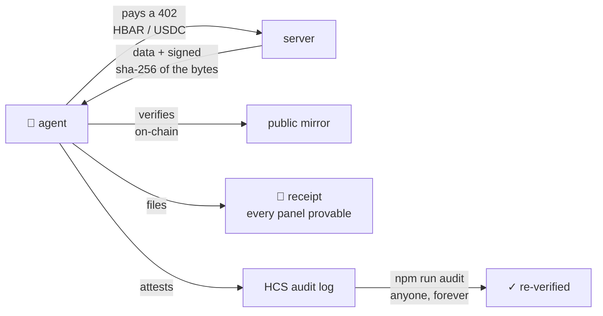
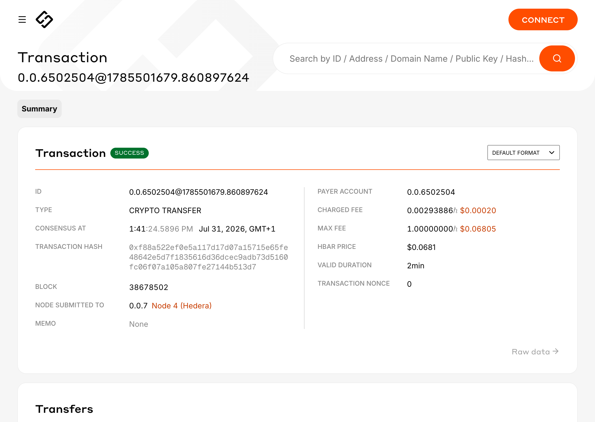
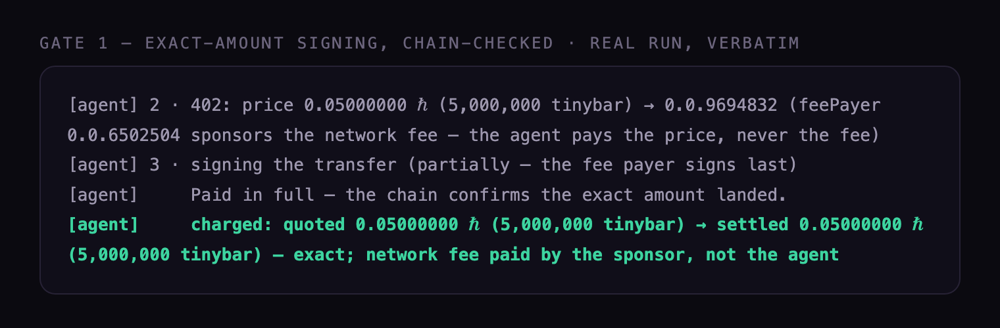
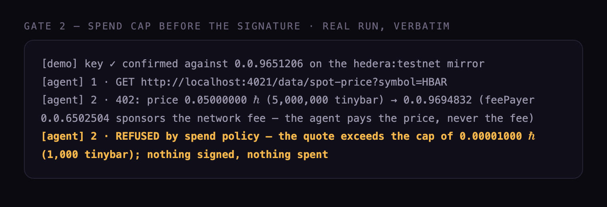
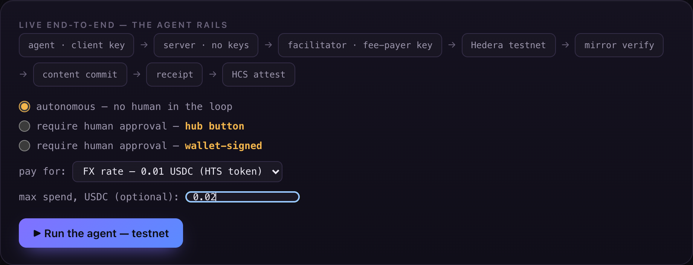
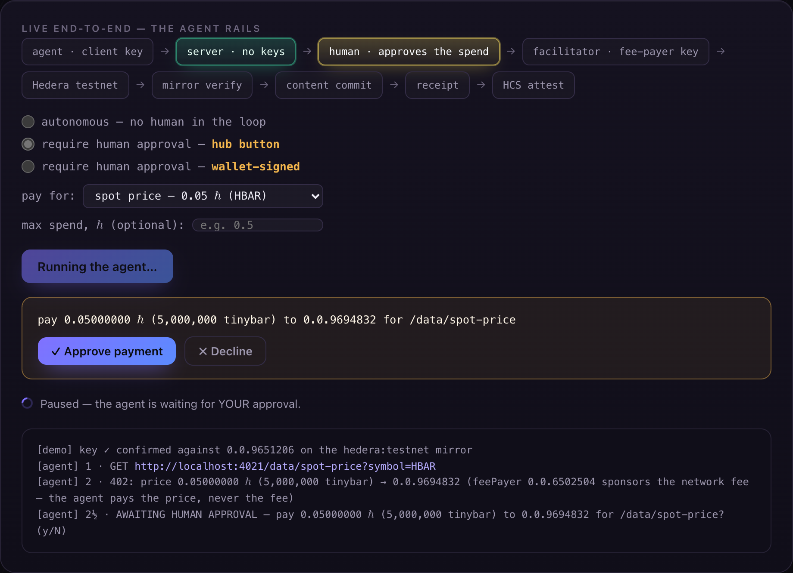
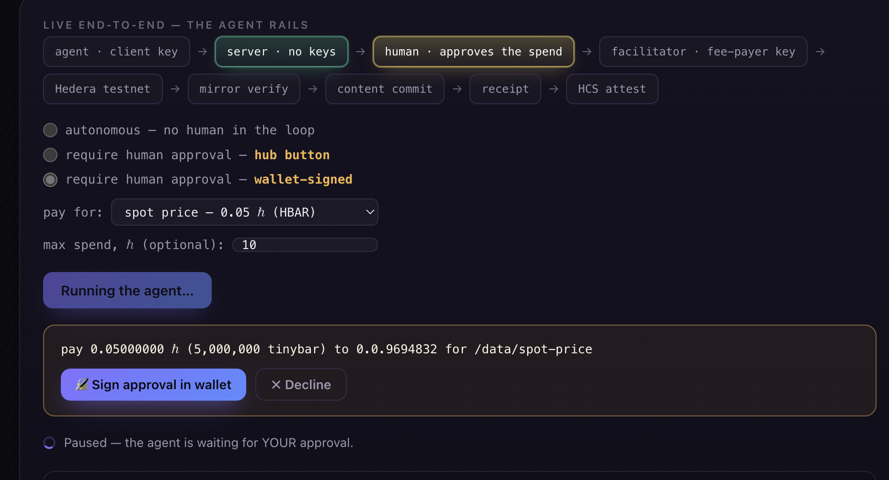
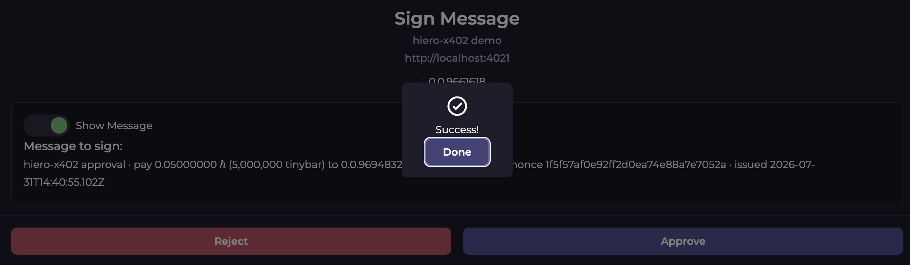
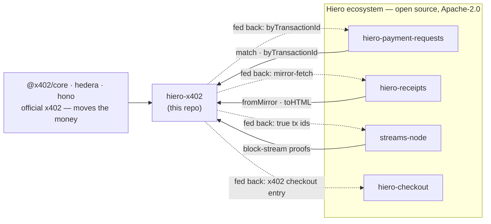

# hiero-x402

[](https://github.com/hiero-hackers/hiero-x402/actions/workflows/ci.yml)
[](https://github.com/hiero-hackers/hiero-x402/actions/workflows/codeql.yml)
[](LICENSE)
[](package.json)
[](https://scorecard.dev/viewer/?uri=github.com/hiero-hackers/hiero-x402)

**Agents that pay per request — and keep receipts that prove it.** The
official `@x402/*` packages move the money — **HBAR or USDC, the buyer's
choice per request**; every other flow
stops at the facilitator's word that it moved. Here the agent checks the
chain itself, the server cryptographically **commits to the bytes it
served**, and every run files a **receipt** — settlement, delivered
content, human consent, each panel independently verifiable, up to a
block-proof receipt stamped VERIFIED by cryptography alone. The whole
trail lands on a **public HCS audit log** that `npm run audit` re-verifies
with no one's cooperation. Prototype, **testnet only** (enforced in code).
System map: [docs/architecture.md](docs/architecture.md).


```mermaid
flowchart LR
    A["🤖 agent"] -- "pays a 402<br/>HBAR / USDC" --> S["server"]
    S -- "data + signed<br/>sha-256 of the bytes" --> A
    A -- "verifies<br/>on-chain" --> M["public mirror"]
    A -- "files" --> R["🧾 receipt<br/>every panel provable"]
    A -- "attests" --> H["HCS audit log"]
    H -- "npm run audit<br/>anyone, forever" --> V["✓ re-verified"]
```

## Proof (real testnet run, 2026-07-31)

```
[agent] 5 · 200 — data: {"product":"spot-price","mock":false,"symbol":"HBAR","price":0.068036,"currency":"USD","source":"hedera-network-exchange-rate","rateExpiresAt":1785502800}
[agent]     settlement claims transaction 0.0.6502504@1785501679.860897624
[agent] 6 · VERIFYING — the mirror node, not the facilitator's word
[agent]     Paid in full — the chain confirms the exact amount landed.
[agent]     charged: quoted 0.05000000 ℏ (5,000,000 tinybar) → settled 0.05000000 ℏ (5,000,000 tinybar) — exact; network fee paid by the sponsor, not the agent
[agent]     hashscan: https://hashscan.io/testnet/transaction/1785501684.589679895
[agent] 6½ · content COMMITTED — 0.0.9651303 signed sha-256 79377a6fb9028868… against this settlement (key mirror-checked)
[agent] 7 · receipt written to receipt.html
[agent] 8 · verdict attested to HCS topic 0.0.9855803
```

**[The settlement on HashScan](https://hashscan.io/testnet/transaction/1785501684.589679895)** —
real data (the chain's own exchange rate), exact amount, committed content,
attested — anyone can re-run the check from the transaction id. Every commitment on the [public audit
topic](https://hashscan.io/testnet/topic/0.0.9855803) re-verifies from
public data alone: `npm run audit`.



## The receipts — the proof you keep

The receipt is the product, and there are two — one per rung of the trust
ladder above the facilitator's word (where every other x402 flow stops):

- the **mirror receipt** — every paid run, checked against the public
  mirror: independent and re-checkable by anyone, still operator-attested,
  so it is honestly stamped **UNVERIFIED**;
- the **block-proof receipt** — merkle root recomputed, threshold signature
  verified, before a single field is believed: the only receipt this repo
  stamps **VERIFIED**. The proof is a real **Hiero block-stream** proof —
  the wiring just isn't on testnet yet (HIP-1056), so today it runs on a
  committed real previewnet block; the cryptography is live either way.
  One click in the hub, or `npm run provenance` (no keys, no env, no
  network).

Same verdict pipeline, different rung; each panel on either is an
independently verifiable claim in its own trust register — never borrowing
authority from the one above it.

- **Settlement** — quoted vs settled to the atomic unit, the transaction
  id, live proof links; stamped for HOW it was read (mirror record vs
  block proof — "verified" is reserved for cryptography).
- **Delivered content** — `SERVER COMMITTED`: the server signed sha-256 of
  the exact bytes against this settlement; it can never deny what it
  served. Re-hash the content and check.
- **Human approval** — who signed which one-time challenge, re-verified
  against their on-chain key.
- **The proof's working** (block receipts) — source block, anchor, and the
  checks that held before a single field was believed.

 

> **Block receipts are beta, and say so on their face**: HIP-1056 block
> streams haven't reached testnet, so the proof runs on a committed real
> **previewnet** block (its true consensus date shows). The amber caveat is
> printed on the receipt itself — the artifact never pretends. And the
> library is **testnet-ready today**: the block source is injected
> ([src/stream.ts](src/stream.ts)), so the day streams land, live x402
> settlements gain VERIFIED receipts by swapping the source — zero code
> changes to the pipeline, the receipts, or the stamps.

## Safety: no spend without consent

_"Impossible to use or drain a user's funds without their explicit
consent"_ — here that is mechanism, not policy:

1. **Exact-amount signing** — one transfer per run, precisely the advertised
   amount, nothing else.
2. **Spend cap before the signature** — over-cap quotes are refused, in the
   quote's own asset, before anything is signed.
3. **Human gates** — button approval, or a wallet-signed single-use
   challenge verified against the approver's on-chain key.
4. **Key isolation** — three processes, three keys, none shared; the server
   holds no payment keys.
5. **Testnet gate in code** ([src/config.ts](src/config.ts)) — mainnet is a
   code change, not a config change.

And the agent **verifies every spend after the fact** — consent going in,
proof coming out. The gates, on screen — real runs, verbatim (the first
two cost nothing: both refusals fire before anything is signed):













## The Hedera integration, verifiable

| Surface                                     | Where                                                          | Public proof                                                                                                                 |
| ------------------------------------------- | -------------------------------------------------------------- | ---------------------------------------------------------------------------------------------------------------------------- |
| HBAR transfers, fee-payer sponsored         | [demo/agent.ts](demo/agent.ts) + facilitator                   | [settled run](https://hashscan.io/testnet/transaction/1785501684.589679895)                                                  |
| HTS payments (official testnet USDC)        | `/data/fx` + hub asset picker                                  | [token 0.0.429274](https://hashscan.io/testnet/token/0.0.429274)                                                             |
| Mirror-node REST (settlement, keys, topics) | [src/verify.ts](src/verify.ts), [demo/audit.ts](demo/audit.ts) | [the raw record a verdict reads](https://testnet.mirrornode.hedera.com/api/v1/transactions/0.0.6502504-1785501679-860897624) |
| HCS attestation log                         | [src/attestation.ts](src/attestation.ts)                       | [live topic 0.0.9855803](https://hashscan.io/testnet/topic/0.0.9855803) · `npm run audit`                                    |
| Network exchange rate                       | `/data/spot-price` serves it live                              | [the endpoint](https://testnet.mirrornode.hedera.com/api/v1/network/exchangerate)                                            |
| HIP-1056 block streams                      | [src/stream.ts](src/stream.ts)                                 | `npm run provenance` — offline, keyless                                                                                      |
| HIP-820 wallet signing (HashPack)           | hub wallet-approval mode                                       | the consent panel on any wallet-approved receipt                                                                             |

**One paid request, by the numbers:**

- **2 on-chain transactions** — the fee-payer-sponsored transfer (**HBAR or
  USDC**, switchable per request from the hub) and its HCS attestation;
- **4 Hedera services in one flow** — transfer/HTS settlement, a consensus
  topic, the mirror REST API, and the network's own exchange-rate feed
  (which is also the data being sold);
- **4+ mirror lookups, all free** — the agent's key check, the settlement
  record, the content-signer's key, the approver's key in wallet mode;
- **up to 3 signatures verified post-settlement** — the settlement itself
  against the chain, the server's content commitment, and the human's
  consent — each against on-chain keys, none on anyone's word.

Fees are fixed and sub-cent, finality is seconds, the mirror is free: one
modest paid API at 10 req/s is **~1.7M Hedera transactions a day**, each
with a verifiable receipt.

## Fed back to the ecosystem

Runs entirely on published packages — no forks — and upstreamed what it
learned as **shipped versions** in the **Hiero ecosystem**: all open
source, all **Apache-2.0**, installable by any Hedera builder today:
[`byTransactionId`](https://github.com/hiero-hackers/hiero-payment-requests)
(payment-requests v0.1.2) ·
[`mirror-fetch`](https://github.com/hiero-hackers/hiero-receipts)
(receipts v0.2.0) · true block-stream transaction ids
([streams-node](https://github.com/hiero-hackers/streams-node) v0.2.0) ·
x402 challenges as a [hiero-checkout](https://hiero-hackers.github.io/hiero-checkout/)
entry — the same priced resource is a 402 for agents AND a checkout QR for
humans, judged by the same rule:


```mermaid
flowchart LR
    C["@x402/core · hedera · hono<br/>official x402 — moves the money"] --> X["hiero-x402<br/>(this repo)"]
    subgraph HIERO["Hiero ecosystem — open source, Apache-2.0"]
      P["hiero-payment-requests"]
      R["hiero-receipts"]
      SN["streams-node"]
      CK["hiero-checkout"]
    end
    P -- "match · byTransactionId" --> X
    R -- "fromMirror · toHTML" --> X
    SN -- "block-stream proofs" --> X
    X -. "fed back: byTransactionId" .-> P
    X -. "fed back: mirror-fetch" .-> R
    X -. "fed back: true tx ids" .-> SN
    X -. "fed back: x402 checkout entry" .-> CK
```

## Run it

Two funded ECDSA testnet accounts: facilitator (sponsors fees) and agent
(pays); the server holds no payment keys. Testnet **HBAR** is free from the
[Hedera Portal faucet](https://portal.hedera.com/faucet); testnet **USDC**
for the token route comes from [Circle's faucet](https://faucet.circle.com)
(pick Hedera Testnet — auto-association does the rest).

```sh
npm install            # @hiero-hackers packages need a read:packages token
cp .env.example .env   # fill in the two accounts
npm run demo           # facilitator (:4020) + server (:4021) — hub at :4021/ui
npm run e2e            # the agent: 402 → sign → 200 → VERIFY → receipt.html
```

The hub at `:4021/ui` is the demo — every control below is on it. All
knobs, one page: [docs/configuration.md](docs/configuration.md).

## Develop

`npm run verify` — typecheck, lint, format, tests, coverage floored at
**100% statements and branches**, all offline. Ground rules:
[CONTRIBUTING.md](CONTRIBUTING.md) · security posture:
[SECURITY.md](SECURITY.md) · the research that decided everything:
[research/](research/).

## License

Apache-2.0
