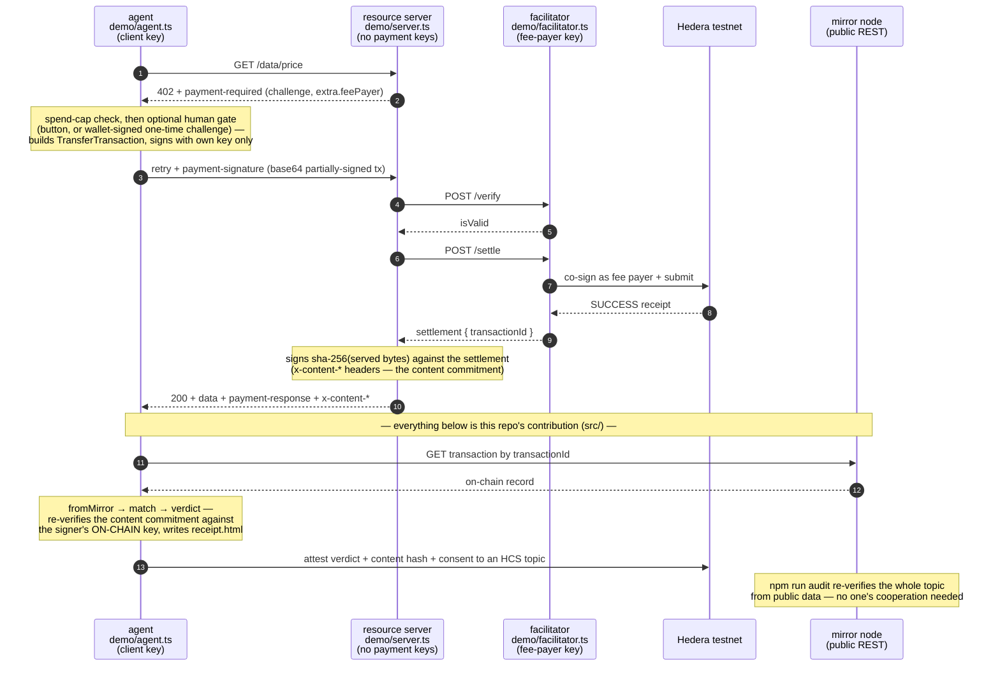
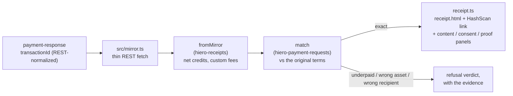

# Architecture

What runs where, who trusts whom, and why each line is drawn where it is.
The evidence behind every decision lives in [research/](../research/).

## The system



Everything down to the `200` is the standard x402 flow, implemented by the
**official `@x402/*` packages** — we write wiring, not plumbing
([research/02](../research/02-hedera-mapping.md)). The tail is this repo's
contribution: nothing downstream trusts the facilitator's word — the agent
checks the chain itself, the server commits to what it served, and the
whole trade lands on an append-only public log.

### The independent check, as a pipeline



The `match` rule is the same one hiero-checkout's merchant and payer already
share — three parties now agree on what "paid" means, none by trusting
another's word.

### The content side, as a protocol

The settlement proves the money moved; the **content commitment** binds the
served bytes to it. One canonical byte sequence
(`src/content.ts` · `contentCommitmentMessage`): the REST-normalized
transaction id, the route path (`commitmentReference` — the one owner of
that convention), and sha-256 of the exact bytes. The server signs it
(producer half: `contentCommitmentHeaders`), the agent re-verifies against
the signer's on-chain key (never the header's claims), the attestation
carries hash + signature onto the topic, and `demo/audit.ts` re-verifies
every commitment from the log alone. A commitment binds bytes to a payment
— it does not make the data true, and every artifact says so.

## Trust model

| Party           | Holds                                                        | Trusts                                                                                          | Verified by                                                             |
| --------------- | ------------------------------------------------------------ | ----------------------------------------------------------------------------------------------- | ----------------------------------------------------------------------- |
| Agent (client)  | its own key (`.env`)                                         | nothing after the 200 — it checks mirror, commitment, consent                                   | —                                                                       |
| Resource server | **no payment keys** (optional signing-only content identity) | the facilitator's verify/settle answers                                                         | agent's mirror check catches a lying/failing facilitator after the fact |
| Facilitator     | fee-payer key (`.env`)                                       | the transaction bytes it inspects (MUST-rules, [research/02](../research/02-hedera-mapping.md)) | pre-submit structural inspection + preflight                            |
| Human approver  | their wallet key (never shared)                              | the one-time challenge shown (nonce + issue time)                                               | signature re-verified against their on-chain key; single-use            |
| Mirror node     | public data                                                  | —                                                                                               | it _is_ the chain's record; anyone can re-query it                      |
| Auditor         | nothing — a topic id                                         | nothing: re-verifies every signature from public data                                           | `npm run audit`, or the hub's session-scoped audit view                 |

Independent verifications, on purpose, at different layers: the facilitator
verifies **before** submitting; the agent verifies **after** settlement;
the auditor re-verifies **forever after**, from the log alone. Different
failure modes, different checkers, no shared trust.

## Repo layout and responsibilities

```
src/                      the reusable library — the PROTOCOL: schemas, wire
                          formats, verification. No SDK, no keys, no env.
  requirements.ts         PaymentRequest ⇄ x402 PaymentRequirements (pure mapping)
  verify.ts               settlement → mirror → fromMirror → match → verdict;
                          readPaymentResponseHeader (both header spellings,
                          REST-normalized id — the one canonical form)
  stream.ts               the same verdict from a cryptographically PROVEN block
                          (proof checked first, fail-closed)
  content.ts              the content-commitment schema: canonical message,
                          producer/consumer header halves, commitmentReference,
                          sha-256 helpers
  attestation.ts          the topic wire format (verdict + content block) and
                          attestationCommitmentMessage — the topic is self-auditing
  receipt.ts              verdict (+ content / consent / proof panels) → the
                          printable HTML artifact; register-disciplined wording
  mirror.ts               thin typed fetch for the REST endpoints needed
  config.ts               the testnet gate: refuses hedera:mainnet in code
  errors.ts               discriminable failure kinds
  index.ts                barrel — a consumer can build their own agent/server
                          from this surface alone

demo/                     ONE application of the protocol — keys, env, I/O, UI
  facilitator.ts          official engine + fee-payer key; policy refusals
  server.ts               env → createApp; resolves keys against the mirror,
                          boot lookups in parallel
  app.ts                  the Hono factory (env-free, conformance-bootable):
                          402 routes, content-commitment middleware, SSE runs
                          with typed events, one-time approval challenges,
                          session-gated receipts, /demo/audit, /demo/provenance
  hub.ts                  the dashboard as a pure template: run modes, asset
                          picker, asset-denominated spend cap, live rails,
                          self-refreshing receipt cards, audit view
  agent.ts                the protagonist: 402 → cap check → optional human
                          gate → sign → verify settlement → verify commitment →
                          re-verify consent → receipt → attest. Plain-words
                          failure diagnosis; exit codes 0/2/3/4 as the outcome API
  audit.ts                auditTopic() + CLI: re-verify every commitment on a
                          topic from the mirror alone
  attest.ts               HCS submit (verdict + content + consent)
  provenance.ts           runProvenance() + CLI: block-proof rung on committed
                          proven blocks, served by the hub's one-click button
  shared.ts               catalog, env access, mirror account fetch, the ONE
                          signature-verification core, key resolution
  policy.ts / quiet.ts / up.ts   facilitator policy · SDK-noise filter · boot

test/                     the offline suite (100% statement AND branch floor);
                          test/fixtures/ holds real preview-network blocks
docs/                     this file, configuration.md, the receipt screenshots
research/                 the evidence; this file the map
```

The line between `src/` and `demo/` is the publish line: `src/` is the
x402-on-Hiero protocol; `demo/` is one opinionated application of it.

## Decisions, with reasons

- **Build on `@x402/*` 2.19.0, don't reimplement** — Hedera is an officially
  specified scheme; a re-port is a worse copy. Pin exact versions.
- **One canonical transaction-id spelling** — everything signed, attested,
  linked, or compared uses the REST form (`0.0.x-seconds-nanos`), normalized
  at the wire boundary (`readPaymentResponseHeader`). The SDK form appears
  only where the SDK demands it.
- **One owner per convention** — the signed reference (`commitmentReference`),
  the digest spelling (`isSha256Hex`), the settlement header, the signature
  core: each lives in exactly one place, because every one of them once
  existed in two drifting copies.
- **Machine facts ride typed channels** — run outcome, paused terms,
  settlement id, and receipt events are SSE events parsed once server-side;
  the human-readable narration is display, never parsed for behavior.
- **Receipts are session artifacts** — a stale receipt.html must never pass
  as this run's output: mtime-vs-boot gating, per-card timestamps, and
  outcome-honest run status (declined ≠ failed ≠ unverified ≠ paid).
- **Self-hosted facilitator in the demo** — a live demo must not depend on a
  third party's uptime.
- **HBAR and USDC, explicitly** — HBAR is the faucet-fundable main path; the
  official testnet USDC route exercises HTS end to end (association,
  preflight, token settlement), selectable from the hub.
- **Keys only where they must be** — agent and facilitator hold payment
  keys; the server's optional content signer can attest and never spend;
  `src/` is key-free by construction.
- **Everything testable offline** — fixture-driven verdicts, a mock
  facilitator that settles, wire round-trips. The only networked run is the
  demo itself.
- **The trust ladder is explicit** — facilitator's word → public mirror →
  block-stream proof; same verdict assembly at every rung; every artifact
  states its provenance and its limits in plain words.

## Growth seams (named now, built when asked)

Multi-agent correlation is payment-requests' `byUniqueAmount`; merchant
notifications are the hiero-notifications `fulfils` adapter; discovery /
MCP / A2A are spec'd upstream; the approval-challenge wire format moves
into `src/` the day a second consumer parses it; and when HIP-1056 block
streams reach testnet, the e2e verdict gains cryptographic provenance by
swapping the source — the seam `stream.ts` and the receipts were built
around.
